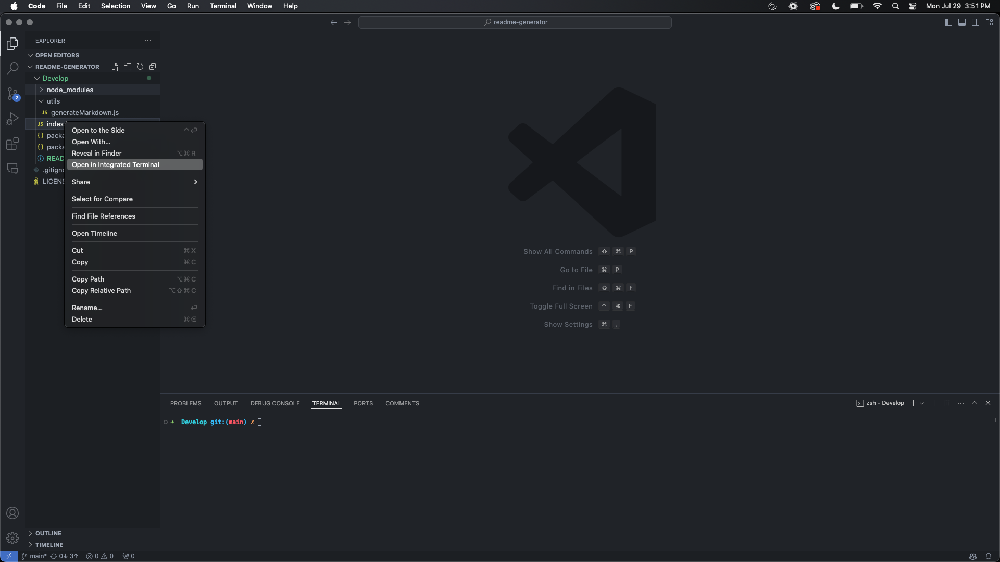
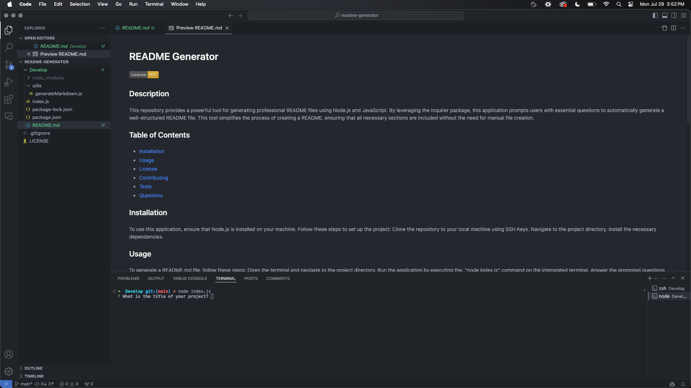

# README Generator

## Description
This repository provides a powerful tool for generating professional README files using Node.js and JavaScript. By leveraging the Inquirer package, this application prompts users with essential questions to automatically generate a well-structured README file. This tool simplifies the process of creating a README, ensuring that all necessary sections are included without the need for manual file creation.

## Table of Contents
- [Installation](#installation)
- [Usage](#usage)
- [License](#license)
- [Contributing](#contributing)
- [Tests](#tests)
- [Questions](#questions)

## Installation
To use this application, ensure that Node.js is installed on your machine. Follow these steps to set up the project: Clone the repository to your local machine using SSH Keys. Navigate to the project directory. Install the necessary dependencies.

## Usage
To generate a README.md file, follow these steps: Open the terminal and navigate to the project directory. Run the application by executing the, "node index.js" command on the intergrated terminal. Answer the prompted questions to provide information about your project.  Upon completion, a README.md file will be generated in the project directory.

https://github.com/user-attachments/assets/802853ee-38c9-40e3-b437-0629d7684d71

## License
This project is licensed under the [MIT](https://opensource.org/licenses/MIT) license.

## Contributing
Contributions are welcome! If you have suggestions for improvements or new features, please create an issue or submit a pull request. For major changes, please open an issue first to discuss what you would like to change. Thank you!

## Tests
While there are no package.json test scripts, you can refer to the usage section to get the program working. Running node index.js will begin running the script.

## Questions
If you have any questions, you can reach me at [berczikbryce@gmail.com](mailto:berczikbryce@gmail.com). You can also find more of my work at [bryceberczik](https://github.com/bryceberczik) on Github.
